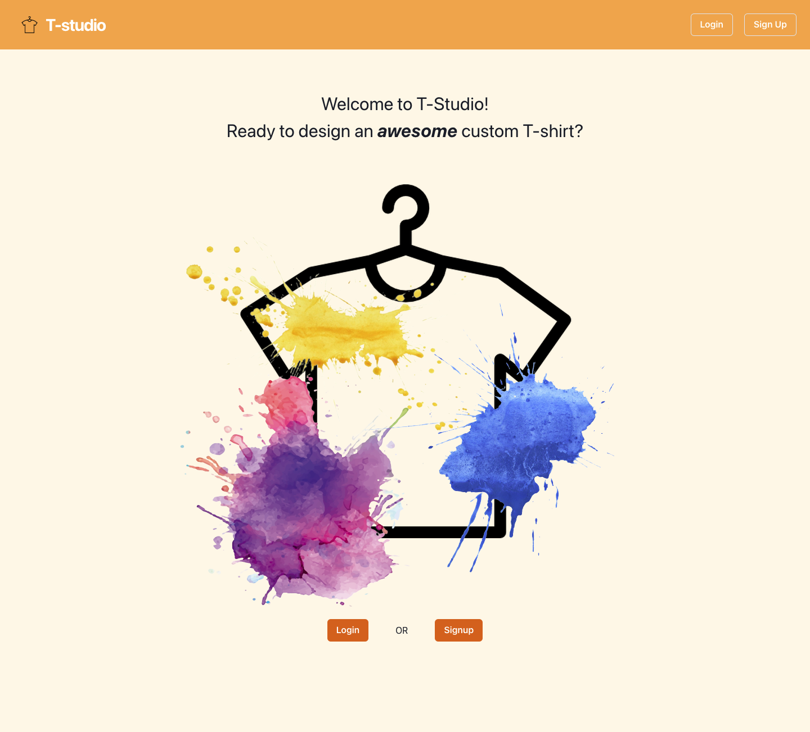
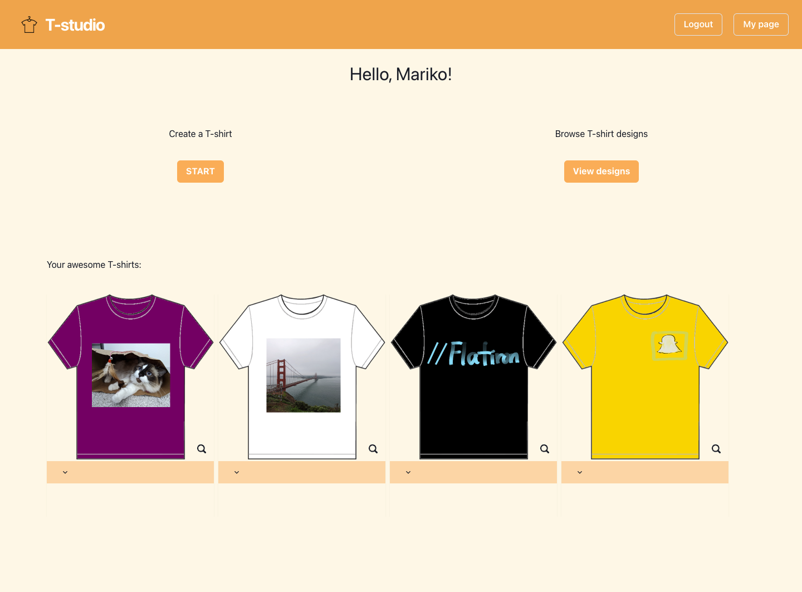
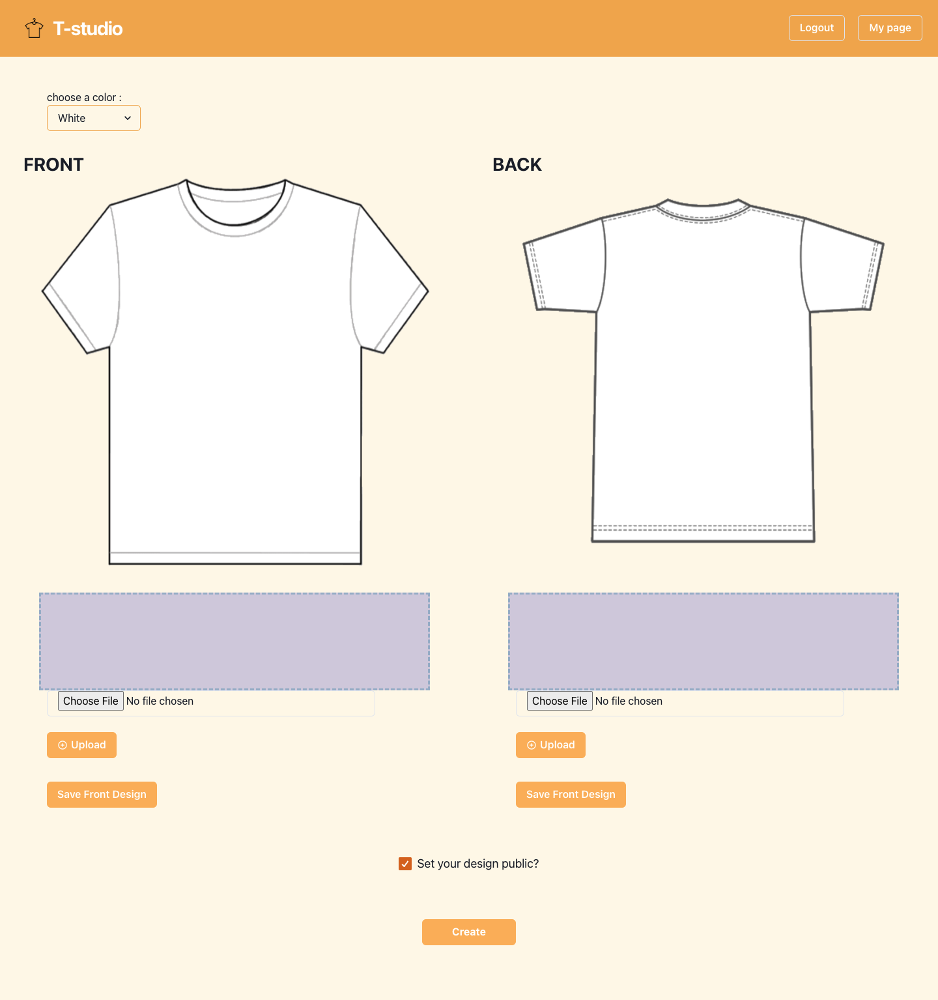
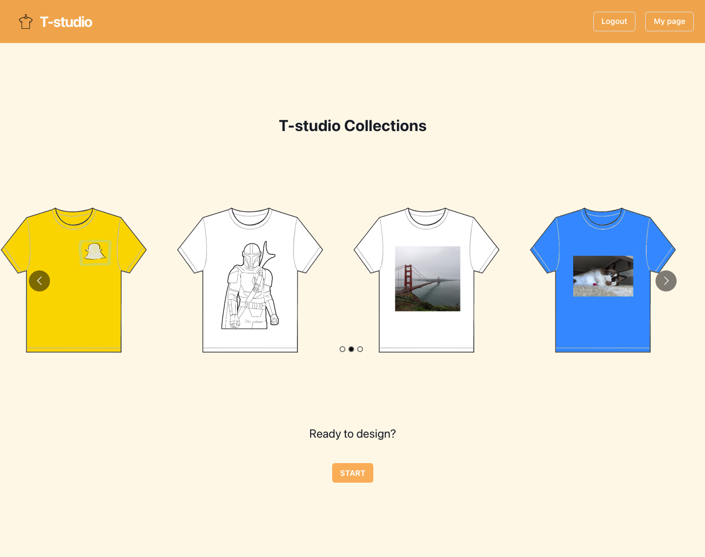

# T-studio

## About

T-studio is my very first full-stack application. T-studio is a T-shirt design app that let users create and share thier awesome designs inside of the app.

T-studio's homepage.


After logging in or signing up T-studio, users can access to their "mypage". In "mypage", users can delete or update the privacy setting of their designs.



There are two options that users can choose: 
1. Design a T-shirt
Users can design a T-shirt by choosing a color and importing up to 5 images each side.



2. View other users awesome designs
When creating a T-shirt, users can select the design to open to a public or not. If they choose to open it, the T-shirt design will be shown in the gallery page. When clicking a T-shirt design, users can see the front and back designs.



## Languages used

Frontend
- JavaScript
- React
- Chakra UI

Backend

- Ruby
- Ruby on Rails
- Postgresql


## Running T-studio locally

After cloning the repp, run the following command to view the project:

```
bundle install
rails db:;create
rails db:migrate
rails db:seed
rails s
```

These commands will install dependencies, create a postgres database, migrate and create tables, and seed the database before starting the API's server. Next you'll need to open another window of your terminal and  start the frontend  with the following commands:

```
cd client
npm install
npm start
```

## Controbutor 
Mariko Janes
[LinkedIn](https://www.linkedin.com/in/mariko-janes/),
[Blog](https://medium.com/@marikojanes)
